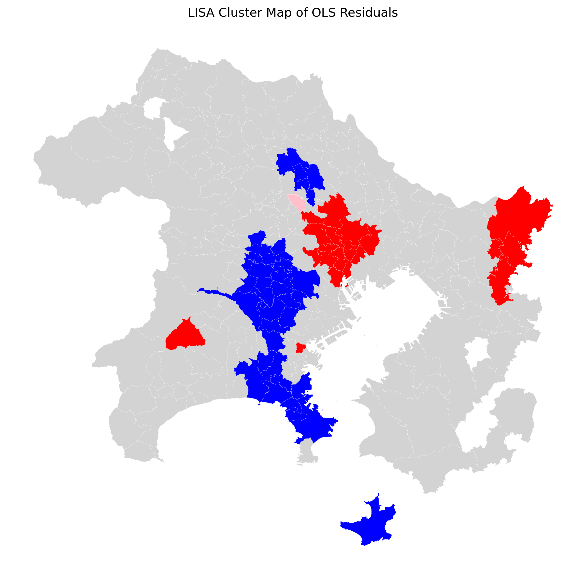
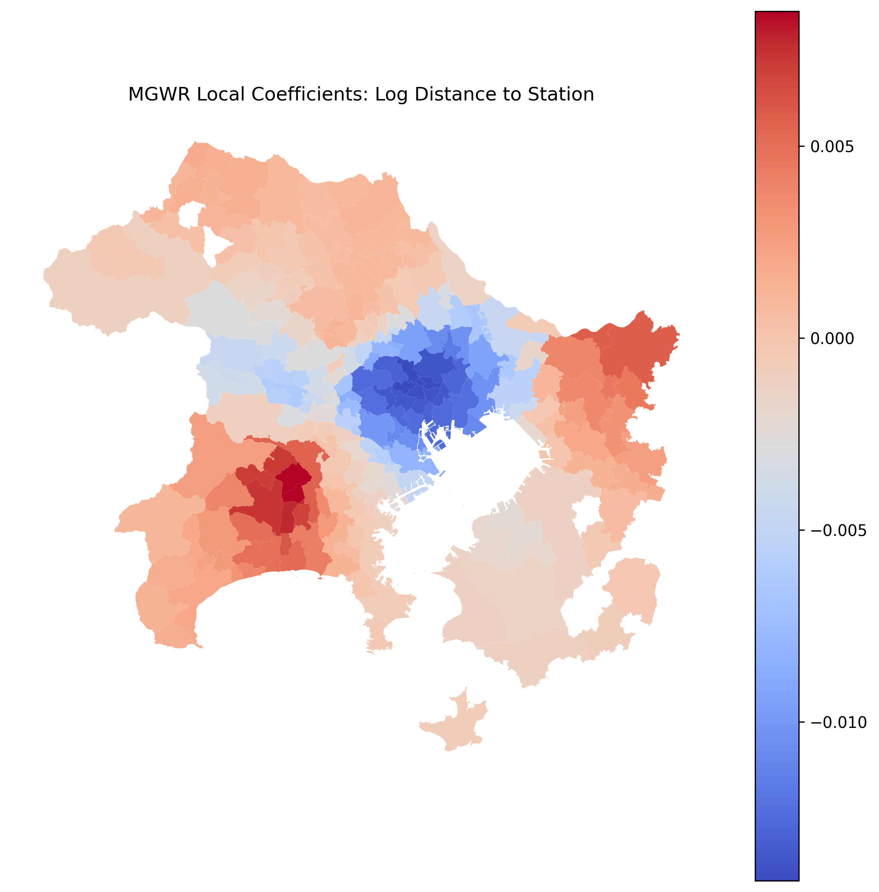

# Spatial Concentration and Heterogeneous Mechanisms of Foreign Population Distribution in the Tokyo Metropolitan Mainland Area

## Overview

This project examines the spatial concentration of foreign population in the Tokyo metropolitan mainland area using official Japanese spatial and statistical data. It integrates administrative boundaries, foreign population attributes, railway station accessibility, and residential land-price data into a municipal-level spatial dataset.

This repository presents a compact academic portfolio relevant to urban environment, environmental geography, land-related spatial interpretation, and place-based analysis in metropolitan Japan.

The analysis combines global and local spatial methods, including OLS, Moran’s I, LISA, and MGWR, in order to identify:
- whether foreign population concentration is spatially clustered,
- how it is associated with railway accessibility and residential land price,
- and whether these relationships vary across municipalities.

It is intended as a concise research portfolio for applications in urban geography, environmental geography, spatial data science, and migration-related spatial analysis.

## Research Questions

1. Is foreign population concentration spatially clustered in the Tokyo metropolitan mainland area?
2. How are foreign population ratios associated with railway accessibility and residential land price?
3. Do these relationships remain constant across space, or do they vary locally?

## Study Area

The study focuses on the mainland part of the Tokyo metropolitan area, covering Tokyo and surrounding municipalities in the wider metropolitan belt. Outlying islands were excluded in order to avoid distortion in accessibility and distance-based measures.

## Data

This project integrates the following categories of data:

- Administrative boundary data
- Foreign population statistics
- Railway station data
- Official residential land-price data

A separate file, `data/data_sources.md`, documents the datasets and their roles in the workflow.

## Methods

The analytical workflow consists of the following stages:

1. Administrative boundary processing
2. Population attribute merging
3. Station accessibility feature engineering
4. Exploratory spatial data analysis
5. Residential land-price integration
6. Baseline OLS modeling
7. Spatial residual diagnostics using Moran’s I and LISA
8. MGWR estimation for local spatial heterogeneity

## Main Findings

The current results show that:

- In municipalities such as Kawaguchi, concentration appears to be supported by near-core accessibility and settlement capacity rather than by low land value alone, suggesting the combined importance of commuting conditions, employment structure, and migrant networks.
- In eastern inner metropolitan areas such as Edogawa, higher land value does not translate into a straightforward negative effect on foreign concentration. This challenges a simple cost-exclusion narrative and points to the importance of rental-market segmentation, service infrastructure, and established settlement effects.

The identified concentration clusters should therefore be interpreted as land-system units in which demographic concentration, housing conditions, transport dependence, and environmental exposure may overlap. This provides a strong basis for future research linking migrant settlement to flood risk, heat stress, evacuation accessibility, and socio-ecological vulnerability.


## Repository Structure

```text
.
├─ README.md
├─ requirements.txt
├─ data/
│  ├─ raw/
│  ├─ processed/
│  └─ data_sources.md
├─ notebooks/
│  ├─ 00_project_setup.ipynb
│  ├─ 01_boundary_processing.ipynb
│  ├─ 02_population_merge.ipynb
│  ├─ 03_station_accessibility.ipynb
│  ├─ 04_exploratory_analysis.ipynb
│  ├─ 05_land_price_processing.ipynb
│  ├─ 06_baseline_ols.ipynb
│  ├─ 07_spatial_residual_diagnostics.ipynb
│  └─ 08_mgwr_analysis.ipynb
├─ outputs/
│  ├─ figures/
│  └─ tables/
└─ docs/   
   └─ project_brief_en.md
```

## Selected Figures
### LISA Cluster Map of OLS Residuals

### MGWR Local Coefficients: Log Distance to Station



## Supporting Documents
- [Project Brief](docs/project_brief_en.md)